# Website E-Commerce ( Personalia )

## Deskripsi Project 
Saya membuat website fullstack menggunakan ReactJs dan membuat REST API dengan expressjs dan sequelize sebagai orm. dengan fungsi sebagai website pembelanjaan di client site dan kelola product di bagian admin


## BACK-END

### **Deskripsi**
**API FASHION E-COMMERCE SEDERHANA** adalah sebuah REST API yang dibuat untuk memungkinkan user melakakukan transaksi pembelian pada sisi user. juga meng kelola product via sisi admin Projek ini dibuat dengan menggunakan `Express JS` sebagai framework dan juga `Sequelize` sebagai ORM nya.

### Berjalan di http://localhost:3000

### Struktur Folder

- `Models` : Untuk membuat model dari setiap table di database
- `Controllers` : Untuk mengatur logika aplikasi seperti login, register, CRUD
- `Routes` : Untuk mendefinisikan rute dari setiap API


### Cara Penggunaan

1. Pastikan `Node.js` dan `npm` sudah terinstall.
2. Clone atau download projek ini.
3. Jalankan `npm install` pada terminal untuk menginstall dependensi yang diperlukan.
4. Buat file `.env` dan beri variabel PORT dan DB_NAME (lalu sesuaikan PORT dan juga DB_NAME dengan database yang diguanakan).
5. Jika table database sudah dibuat jalankan aplikasi dengan mengetikkan `node index.js` / `nodemon index` di terminal.
6. Aplikasi akan berjalan di `http://localhost:PORT`, dengan PORT adalah nomor port yang ditentukan dalam file `.env`.

### Dependecies / Teknologi yang digunakan

1. **express**

    Express JS sebagai framework Node.js untuk mengelola request dan response HTTP

    ```bash
   npm i express
    ```

2. **mysql**

    package untuk melakukan koneksi ke database

    ```bash
    npm i mysql
    ```

3. **dotenv**

    Dotenv untuk mengatur variabel lingkungan
    ```bash
    npm i dotenv
    ```

4. **cors**

    Untuk memberikan akses pada forntEnd

    ```bash
    npm i cors
    ```
5. **sequelize**

    Sebagai Orm yang dipakai

    ```bash
    npm i sequelize
    ```
6. **bcrypt**

    Untuk melakukan hash dan compare

    ```bash
    npm i bcrypt
    ```
7. **jsonwebtoken**

    untuk melakukan pembuatan dan fungsi dengan token

    ```bash
    npm i jsonwebtoken
    ```
8. **nodemon**

    jalankan dengan mengetikan perintah (nodemon namaFile)

    ```bash
    npm install nodemon
    ```

    Perintah ini akan menjalankan server secara terus menerus

    Aplikasi akan berjalan pada port yang ditentukan di file `.env` .

    <br>

    


### UML

### Class Diagram


### Use Case Diagram
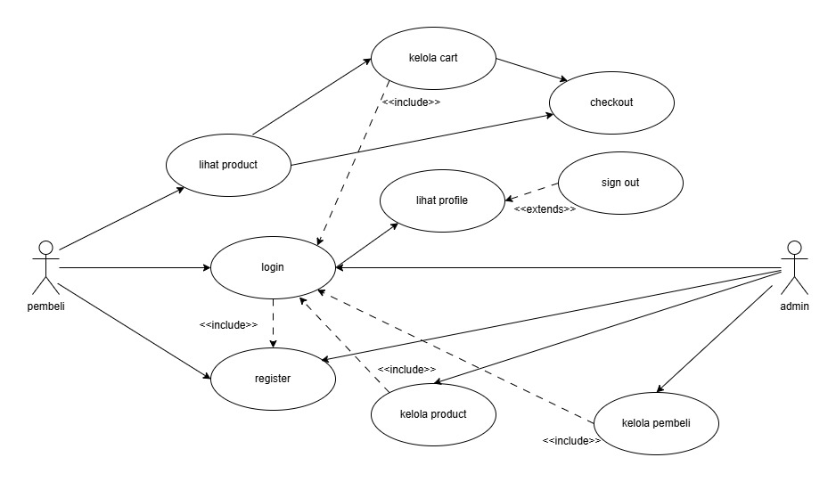

### ERD
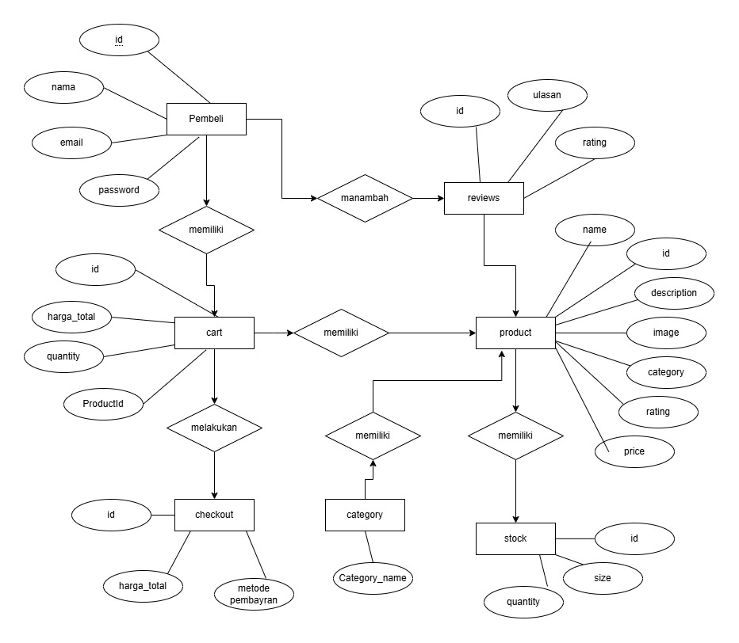

---


## FRONT-END

### Deskripsi
**Website Ecommerce** ini digunakan untuk melakukan transaksi secara online untuk sisi user. sedangkan di sisi admin, digunakan untuk mengelola product yang. menggunakan library reactjs

### Fitur User

**1. Login & Register**
user memasukan credential yang akan dikirim ke dalam database

**Register**

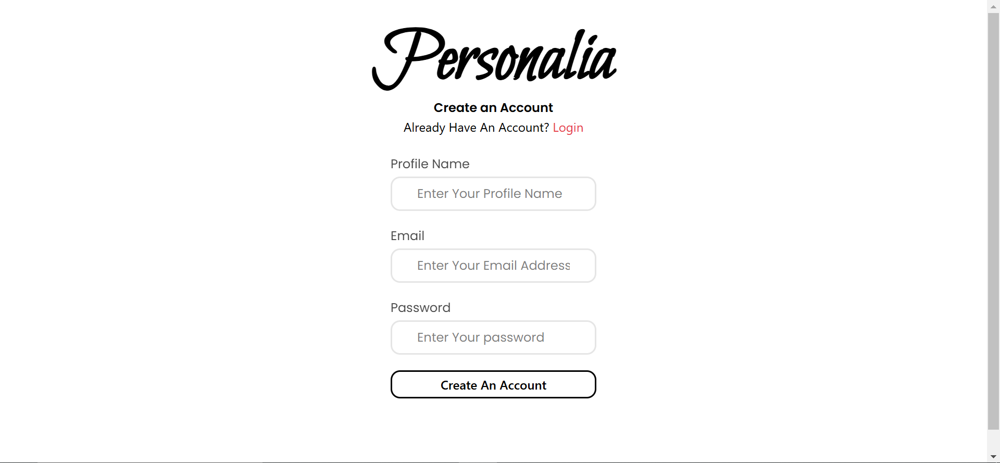

**Login**

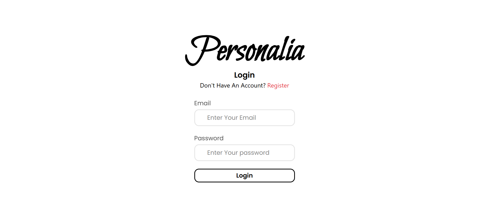

**2. Melihat Homepage**
<br>
<br>

**1.**
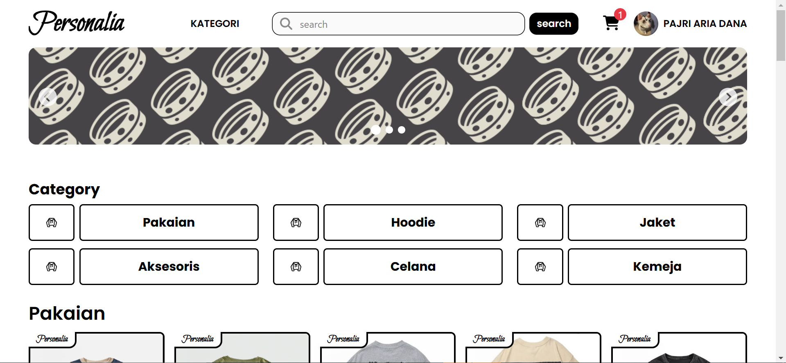

**2.**
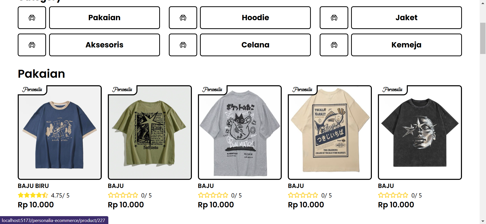
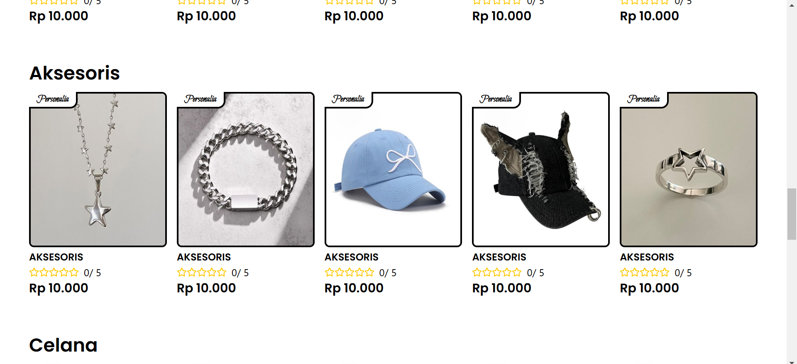

**3.**


## **3. Melihat Product Detail**
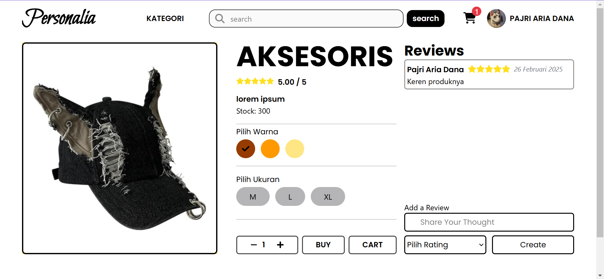

## **4. Mempunyai Cart**
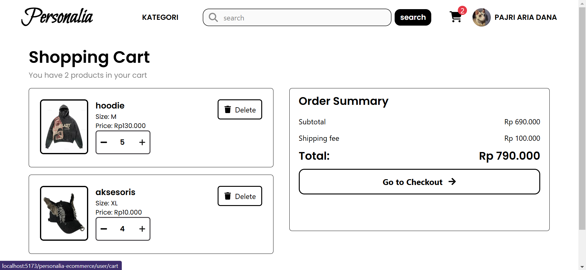


<!-- # Web Detail

### Header Web
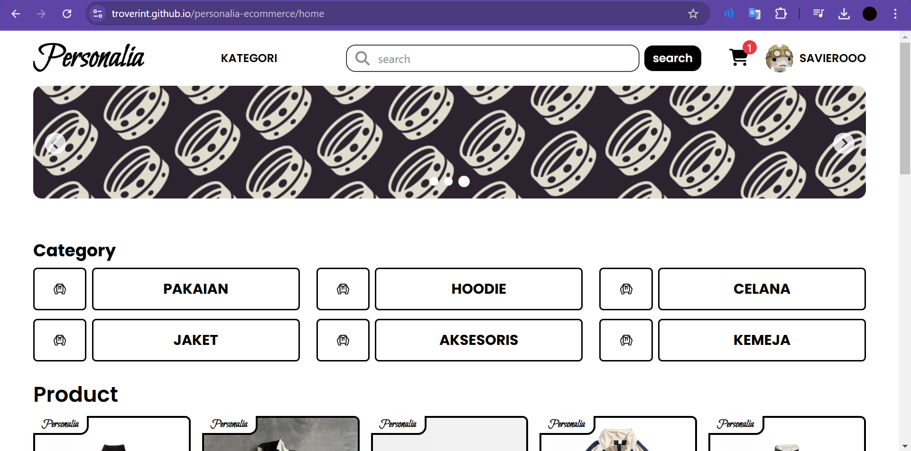

### Product
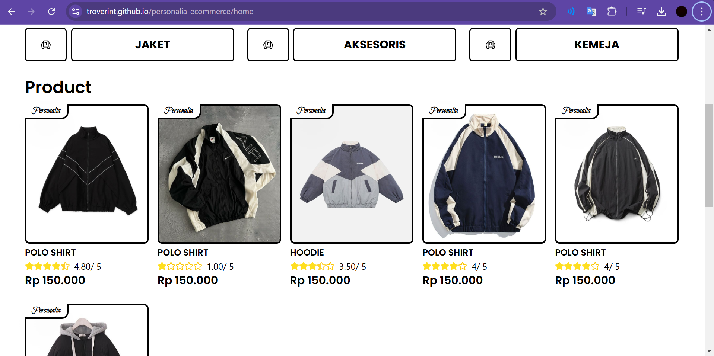

### Product Detail
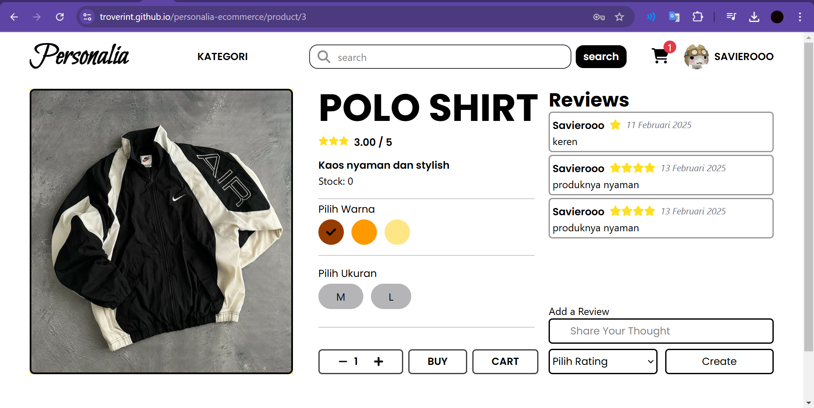

### Cart
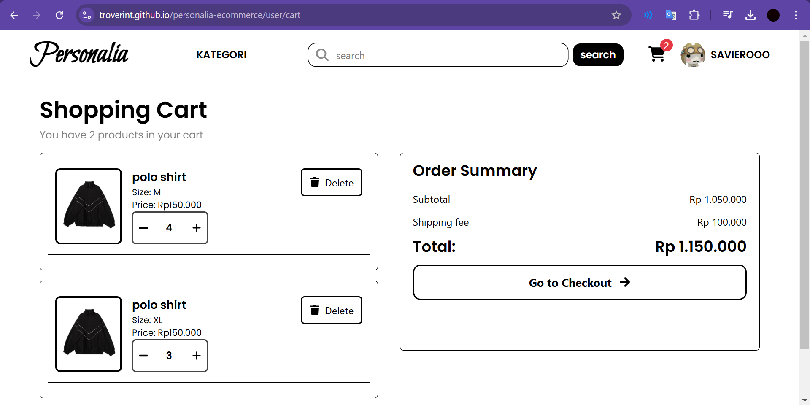 -->
